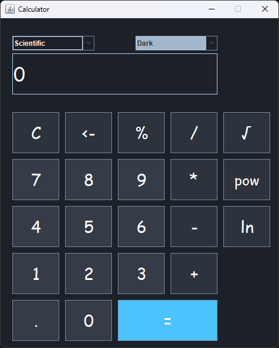

# Calculator
A very basic calculator application created using Java **Swing**. 

## Screenshots
|                Scientific / Dark                | Standard / Colored |
:------------------------------------------------:|:-------------------|
  | 

## Requirements 🔧
* Java 11 or higher.

## Contributing 💡
If you want to contribute to this project and make it better with new ideas, your pull request is very welcomed.
If you find any issue just put it in the repository issue section, thank you.
